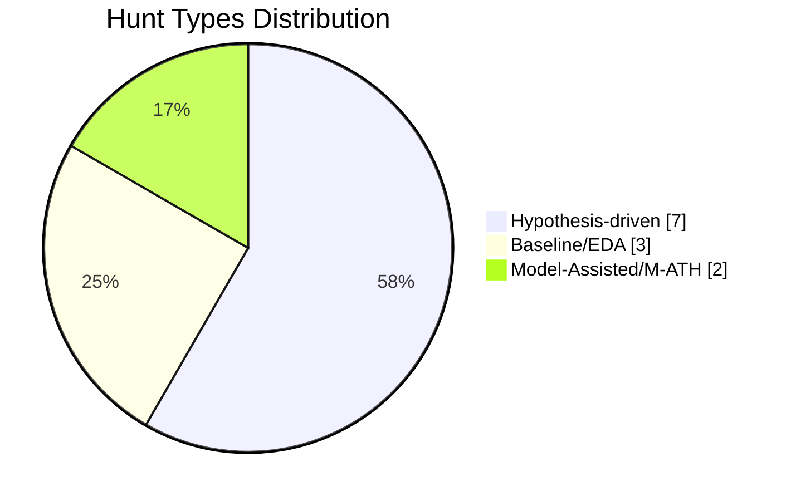
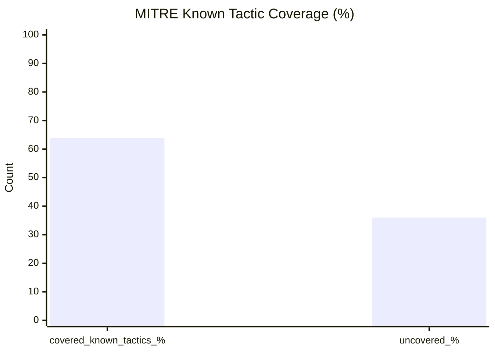

# Threat-Hunting-As-Code

This repository treats threat hunts like maintainable engineering assets: version-controlled, reviewable, measurable, and continuously improved.

## Why Threat Hunting as Code

Traditional hunt tracking often lives in spreadsheets, one-off notes, or disconnected tickets. That creates drift, poor reuse, and weak visibility.

Threat-Hunting-As-Code standardizes hunts so teams can:

- Reuse proven hypotheses and query logic
- Perform thorough reviews with proper accountability
- Measure coverage, cadence, and outcomes over time
- Scale analyst knowledge across teams and time zones

## PEAK Threat Hunting Principles

Use the PEAK model to guide every hunt artifact:

- **P - Prioritized**: Focus on adversary behaviors and assets with highest risk.
- **E - Evidence-driven**: Build hunts on concrete telemetry assumptions, not intuition alone.
- **A - Actionable**: Ensure findings can trigger containment, detection, or hardening actions.
- **K - Knowledge-sharing**: Capture context and lessons learned so future hunts improve.

## Hunt Types

This project supports multiple hunt classes so teams can balance proactive and reactive work:

- **Hypothesis-driven hunts**: Start with a specific adversary technique or suspicious behavior and test it.
- **Intel-driven hunts**: Translate external threat intelligence into internal telemetry checks.
- **Baseline/anomaly hunts**: Establish normal patterns and investigate deviations.
- **Detection-gap hunts**: Validate whether known attack paths bypass current detections.
- **Validation/retest hunts**: Re-run previous hunts after control or environment changes.

## Repository Structure

- `.github/ISSUE_TEMPLATE/new-hunt.yml` - Standard hunt submission form via GitHub Issues.
- `.github/workflows/hunt-metrics.yml` - Workflow that produces hunt metrics/dashboard inputs.
- `.github/workflows/suggest-hunt-ideas.yml` - Workflow for generating or proposing hunt ideas.
- `templates/hunt-template.md` - Canonical hunt content template.
- `templates/campaign-template.md` - Canonical high-level campaign umbrella template.
- `campaigns/` - Campaign markdown artifacts (umbrella only).
- `scripts/metrics/` - Parsing and dashboard generation scripts.
- `docs/dashboard.md` - Dashboard documentation and metric definitions.

## Quick start (campaigns + hunts)

1. **Create a campaign** using the GitHub issue form **New Campaign**, then add the approved umbrella under `campaigns/<campaign_slug>.md` using `templates/campaign-template.md` (set `campaign_slug` to a unique kebab-case value).
2. **Create individual hunts** under `hunts/` and link them to the umbrella by setting **`campaign_slugs`** (preferred) and/or a kebab-case entry in **`campaigns`** that exactly matches the campaign’s `campaign_slug`. Standalone hunts can keep `campaigns: ["none"]` and omit `campaign_slugs`.

After that, open a PR (manually): CI validates hunt + campaign metadata; when merged, metrics refresh `docs/dashboard.md` and auto-update each campaign file’s **Linked hunts** and **Aggregated outcomes** sections.

### Issue submission auto-bootstrap

When a hunter submits **New Threat Hunt** or **New Campaign** intake issues, `.github/workflows/bootstrap-from-issue.yml` automatically:

1. Parses issue-form answers
2. Generates a draft file from the matching template (`hunts/` or `campaigns/`)
3. Creates a unique branch with a commit containing the generated artifact so the hunter can review/refine before submitting a PR

## Issue Guidelines

To keep intake safe and predictable, automated template generation only runs for repository collaborators with **write** access (or higher).

- If the issue author has `write` or `admin` permissions, the bootstrap workflow continues as normal.
- If the issue author has `read`, `triage`, or no collaborator permission, the workflow exits successfully and skips generation.

If you have general questions, ideas, or need help before opening intake issues, use GitHub Discussions or contact the maintainers.

### First hunt checklist (after the umbrella exists)

1. Open GitHub Issues and select **New Threat Hunt**.
2. Fill in required metadata (hunt type, MITRE IDs, data sources/locations, query languages, outcomes).
3. Set **`campaign_slugs: ["your-campaign-slug"]`** (or use a matching kebab-case `campaigns` entry) so the hunt rolls up under the campaign.
4. Copy `templates/hunt-template.md` into `hunts/<your-hunt>.md` and complete PEAK + at least one `threat-hunt-query` block.
5. Open a PR to `main` from your generated/working branch after review; validation fails if required fields or unknown `campaign_slug` references are missing.
6. After merge, the metrics job regenerates the dashboard and updates linked campaign sections.

## Submit a New Hunt (via Issues)

1. Open the **New Hunt** issue form in GitHub Issues.
2. Complete all required fields (hypothesis, data sources, ATT&CK mapping, impact, and owner).
3. Submit the issue for triage and assignment.
4. Convert approved issues into a hunt artifact using `templates/hunt-template.md`.
5. Review the generated or working branch and then open a pull request with the hunt content and supporting logic/queries.

### Hunt Submission Expectations

- Keep hypotheses testable and scoped.
- Include exact telemetry dependencies and data gaps.
- Map to ATT&CK techniques when applicable.
- Document expected analyst actions if the hunt fires.
- Capture result quality (true positive, benign, inconclusive, etc.).

## How the Auto-Dashboard Works

The dashboard pipeline is intended to continuously summarize hunt program health from repository activity.

At a high level:

1. Hunt and campaign metadata are read from `hunts/` and `campaigns/` markdown frontmatter.
2. `scripts/metrics/parse_hunts.py` validates artifacts, links hunts to campaigns by `campaign_slug`, and refreshes auto-sections inside campaign files.
3. The workflow in `.github/workflows/hunt-metrics.yml` runs on pull requests (validation) and after merges to `main` (regenerate + commit).
4. `scripts/metrics/generate_dashboard.py` publishes `docs/dashboard.md` (hunt metrics plus an **Active Campaigns** rollup).

Common metrics include:

- Hunts submitted, approved, and completed
- Hunts by type, ATT&CK tactic/technique, and severity
- Mean time from submission to completion
- Coverage and detection-gap trends over time

## Dashboard Preview

The generated dashboard in `docs/dashboard.md` is Markdown-first, private-friendly, and Mermaid-powered.

### Example Visual Style (Mermaid Preview)

### Screenshot Slots

Add screenshots here once your first dashboard run is generated:

> Tip: You can capture screenshots directly from `docs/dashboard.md` render output in GitHub and save to `docs/assets/`.

## Offline/Private by Design + Extensibility

- **No external APIs required**: metrics and dashboard generation use local Markdown + YAML parsing only.
- **Private-repo friendly**: workflows operate on repository content without third-party SaaS calls.
- **Deterministic output**: controlled vocab fields reduce reporting variance and improve repeatability.
- **Extensible architecture**: parser and dashboard scripts are modular so future AI-assisted enrichments can be added behind optional workflows.
- **Future AI-ready**: `suggest-hunt-ideas.yml` is currently prompt-only (no API calls) and can be upgraded later to optional provider-backed runs.

## Acknowledgments and Attribution

This project builds on established community and industry frameworks. Credit where it is due:

- **PEAK Threat Hunting Framework** (`Prepare`, `Execute`, `Act with Knowledge`) and **ABLE** (`Actor`, `Behavior`, `Location`, `Evidence`) are credited to **Splunk SURGe** and related Splunk Security research/publications.
- **MITRE ATT&CK** tactic/technique taxonomy is created and maintained by **MITRE**; this repository uses ATT&CK IDs for normalized reporting and analytics.
- Markdown dashboard rendering patterns use **Mermaid** syntax and GitHub-native Markdown capabilities.

Primary references:

- [Introducing the PEAK Threat Hunting Framework (Splunk)](https://www.splunk.com/en_us/blog/security/peak-threat-hunting-framework.html)
- [Hypothesis-Driven Hunting with the PEAK Framework (Splunk)](https://www.splunk.com/en_us/blog/security/peak-hypothesis-driven-threat-hunting.html)
- [MITRE ATT&CK](https://attack.mitre.org/)
- [Mermaid](https://mermaid.js.org/)

## Contribution Model

- Use issues for hunt intake and discussion.
- Use pull requests for all hunt content changes.
- Request review from code owners for quality and consistency.
- Keep hunt artifacts concise, testable, and reusable.

See `CONTRIBUTING.md` for contribution conventions as the project matures.

## Roadmap

- Finalize issue template fields and validation rules
- Implement metrics scripts and output schema
- Publish initial dashboard and trend views
- Add CI checks for hunt artifact quality and metadata completeness
