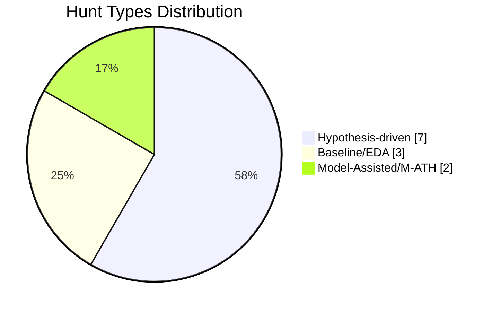
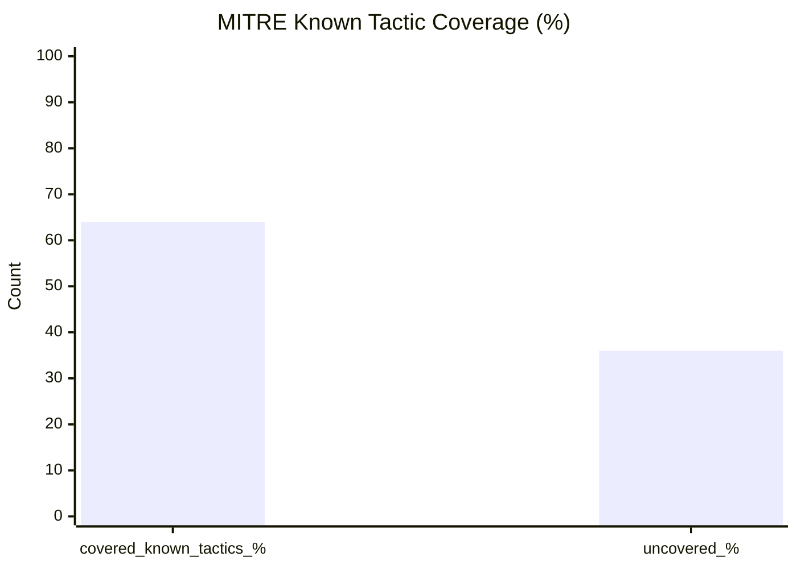

# Threat-Hunting-As-Code

This repository treats threat hunts like maintainable engineering assets: version-controlled, reviewable, measurable, and continuously improved.

## Why Threat Hunting as Code

Traditional hunt tracking often lives in spreadsheets, one-off notes, or disconnected tickets. That creates drift, poor reuse, and weak visibility.

Threat-Hunting-As-Code standardizes hunts so teams can:

- Reuse proven hypotheses and query logic
- Review hunts with security and engineering rigor
- Measure coverage, cadence, and outcomes over time
- Scale analyst knowledge across teams and time zones

## PEAK Threat Hunting Principles

Use the PEAK model to guide every hunt artifact:

- **P - Prioritized**: Focus on adversary behaviors and assets with highest risk.
- **E - Evidence-driven**: Build hunts on concrete telemetry assumptions, not intuition alone.
- **A - Actionable**: Ensure findings can trigger containment, detection, or hardening actions.
- **K - Knowledge-sharing**: Capture context and lessons learned so future hunts improve.

## Hunt Types

This project supports multiple hunt classes so teams can balance proactive and reactive work:

- **Hypothesis-driven hunts**: Start with a specific adversary technique or suspicious behavior and test it.
- **Intel-driven hunts**: Translate external threat intelligence into internal telemetry checks.
- **Baseline/anomaly hunts**: Establish normal patterns and investigate deviations.
- **Detection-gap hunts**: Validate whether known attack paths bypass current detections.
- **Validation/retest hunts**: Re-run previous hunts after control or environment changes.

## Repository Structure

- `.github/ISSUE_TEMPLATE/new-hunt.yml` - Standard hunt submission form via GitHub Issues.
- `.github/workflows/hunt-metrics.yml` - Workflow that produces hunt metrics/dashboard inputs.
- `.github/workflows/suggest-hunt-ideas.yml` - Workflow for generating or proposing hunt ideas.
- `templates/hunt-template.md` - Canonical hunt content template.
- `scripts/metrics/` - Parsing and dashboard generation scripts.
- `docs/dashboard.md` - Dashboard documentation and metric definitions.

## Quick Start (First Hunt in 10 Minutes)

1. Open GitHub Issues and select **New Threat Hunt**.
2. Fill in required metadata:
   - hunt type
   - MITRE techniques/tactics
   - data sources and data source locations
   - query languages and outcomes
3. Submit the issue and get triaged/assigned.
4. Create a branch and copy `templates/hunt-template.md` into `hunts/<your-hunt>.md`.
5. Complete PEAK sections (Prepare, Execute, Act, Knowledge) and add parser blocks:
   - at least one `threat-hunt-query` block
   - IOC blocks as needed
6. Open a PR to `main`.
7. PR validation runs automatically and fails if required metadata is missing.
8. After merge, dashboard metrics are regenerated and committed to `docs/dashboard.md`.

## Submit a New Hunt (via Issues)

1. Open the **New Hunt** issue form in GitHub Issues.
2. Complete all required fields (hypothesis, data sources, ATT&CK mapping, impact, and owner).
3. Submit the issue for triage and assignment.
4. Convert approved issues into a hunt artifact using `templates/hunt-template.md`.
5. Open a pull request with the hunt content and supporting logic/queries.

### Hunt Submission Expectations

- Keep hypotheses testable and scoped.
- Include exact telemetry dependencies and data gaps.
- Map to ATT&CK techniques when applicable.
- Document expected analyst actions if the hunt fires.
- Capture result quality (true positive, benign, inconclusive, etc.).

## How the Auto-Dashboard Works

The dashboard pipeline is intended to continuously summarize hunt program health from repository activity.

At a high level:

1. Hunt metadata and status updates are ingested from repository artifacts.
2. Metrics scripts in `scripts/metrics/` parse and normalize hunt data.
3. The workflow in `.github/workflows/hunt-metrics.yml` runs on schedule and/or repository events.
4. Generated outputs are published into dashboard docs/content (see `docs/dashboard.md`).

Common metrics include:

- Hunts submitted, approved, and completed
- Hunts by type, ATT&CK tactic/technique, and severity
- Mean time from submission to completion
- Coverage and detection-gap trends over time

## Dashboard Preview

The generated dashboard in `docs/dashboard.md` is Markdown-first, private-friendly, and Mermaid-powered.

### Example Visual Style (Mermaid Preview)

### Screenshot Slots

Add screenshots here once your first dashboard run is generated:

> Tip: You can capture screenshots directly from `docs/dashboard.md` render output in GitHub and save to `docs/assets/`.

## Offline/Private by Design + Extensibility

- **No external APIs required**: metrics and dashboard generation use local Markdown + YAML parsing only.
- **Private-repo friendly**: workflows operate on repository content without third-party SaaS calls.
- **Deterministic output**: controlled vocab fields reduce reporting variance and improve repeatability.
- **Extensible architecture**: parser and dashboard scripts are modular so future AI-assisted enrichments can be added behind optional workflows.
- **Future AI-ready**: `suggest-hunt-ideas.yml` is currently prompt-only (no API calls) and can be upgraded later to optional provider-backed runs.

## Contribution Model

- Use issues for hunt intake and discussion.
- Use pull requests for all hunt content changes.
- Request review from code owners for quality and consistency.
- Keep hunt artifacts concise, testable, and reusable.

See `CONTRIBUTING.md` for contribution conventions as the project matures.

## Roadmap

- Finalize issue template fields and validation rules
- Implement metrics scripts and output schema
- Publish initial dashboard and trend views
- Add CI checks for hunt artifact quality and metadata completeness
