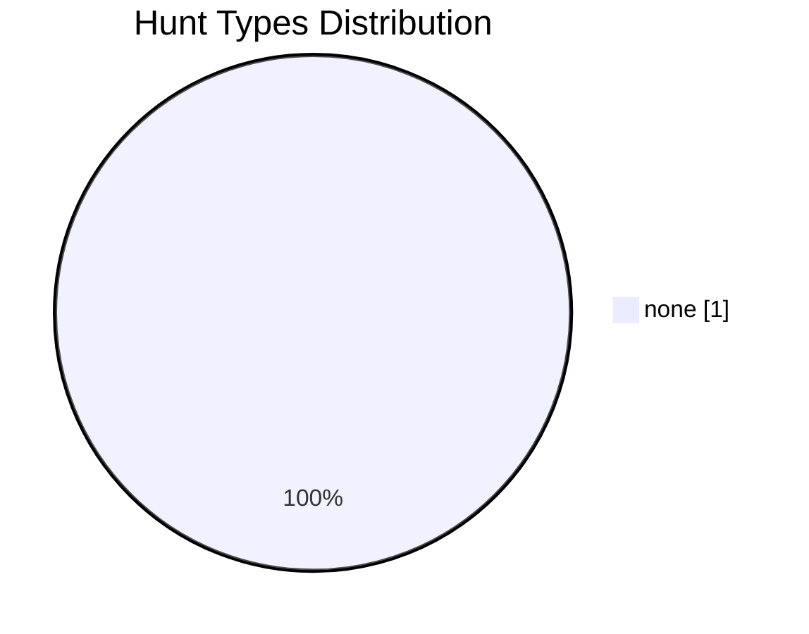
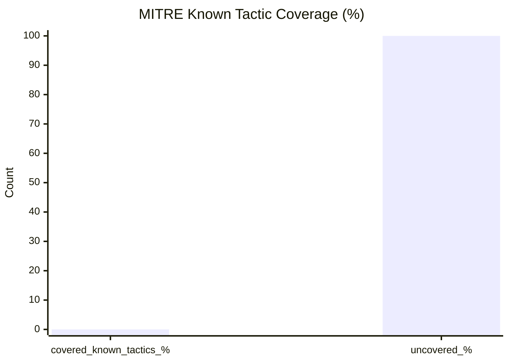
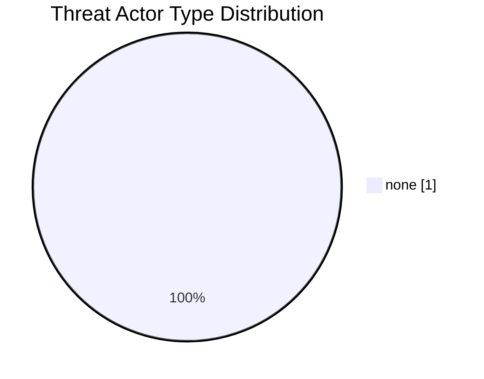

# Threat Hunt Dashboard

_Generated: 2026-04-26 22:11 UTC_

## Active Campaigns

> No campaign files found under `campaigns/`, or none passed validation.

## Summary Stats

| Metric | Value |
| --- | ---: |
| Hunts scanned | 0 |
| Hunts valid | 0 |
| Hunts invalid | 0 |
| Campaigns valid | 0 |
| Campaigns invalid | 0 |
| Hunts total (metrics scope) | 0 |
| Query blocks extracted | 0 |
| IOC blocks extracted | 0 |
| Hunts with detections | 0 (0.0%) |
| Hunts with preventions | 0 (0.0%) |
| Hunts with visibility created | 0 (0.0%) |

## Visuals

### Hunt Types

### MITRE Coverage

### Threat Actor Types

## Recent Hunts

> [!NOTE]
> No hunt rows in JSON (expected when no valid hunts are parsed).

| Hunt ID | Title | Type | Status | Last Updated |
| --- | --- | --- | --- | --- |
| n/a | No hunt detail rows in JSON yet | n/a | n/a | n/a |

## MITRE Coverage Heat Map

| MITRE Tactic ID | Hunts Tagged | Coverage Band |
| --- | ---: | --- |
| `none` | 0 | ⬜ None |

**Known ATT&CK tactic coverage:** 0.0%

**Top techniques:** n/a

## Leadership Export Note

> This dashboard summarizes current threat hunting program output and coverage posture from version-controlled hunt artifacts.

- **Program scale:** 0 hunts in current validated metrics scope.
- **ATT&CK alignment:** 0.0% known tactic coverage represented by hunts.
- **Attribution context:** 0.0% of hunts include named/type threat actor attribution.
- **Campaign intelligence linkage:** 0.0% of hunts mapped to campaign context.
- **Operational outcomes:** detections=0, preventions=0, visibility_created=0.
