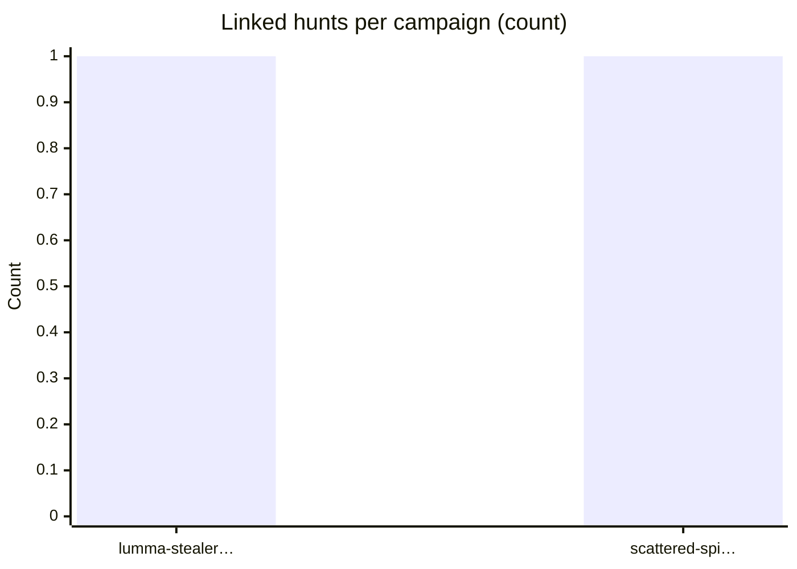
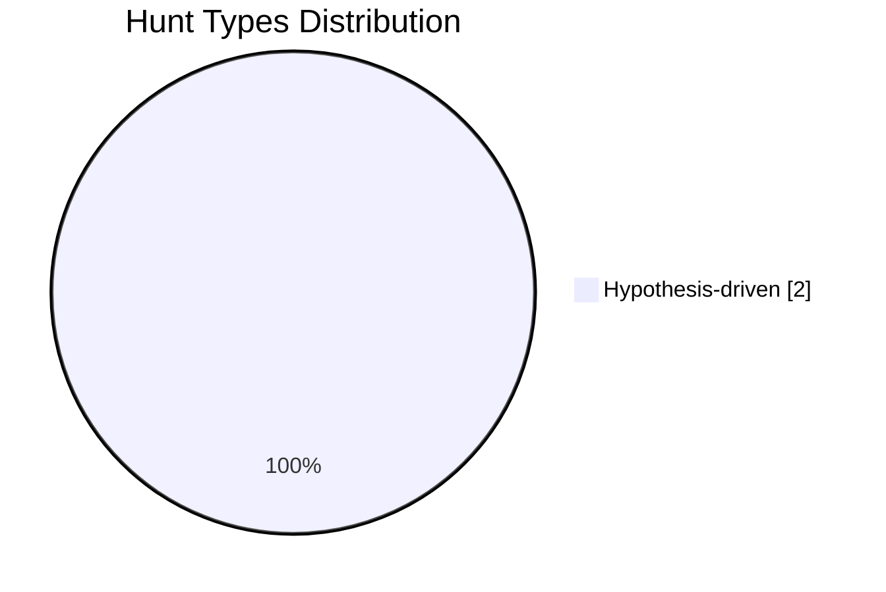
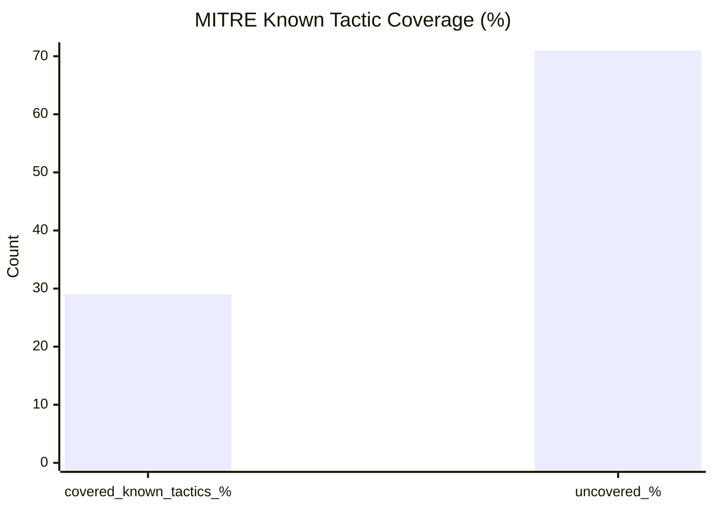
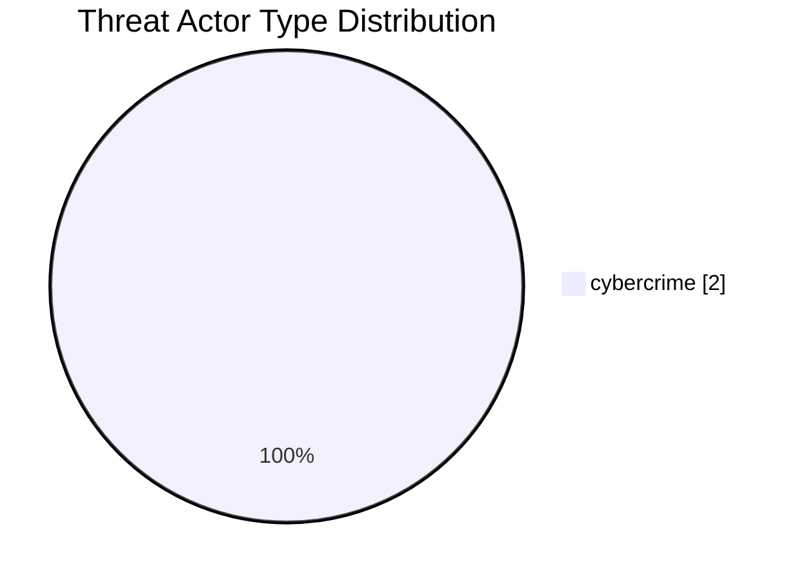

# Threat Hunt Dashboard

_Generated: 2026-05-04 12:56 UTC_

## Active Campaigns

Campaigns with linked hunts (from `campaigns/*.md` and hunt `campaign_slugs` / kebab `campaigns` entries).

| Campaign | Threat actor | # Linked hunts | MITRE % covered (children) | Detections created (hunts) | Last activity | Campaign file |
| --- | --- | ---: | ---: | ---: | --- | --- |
| Lumma Stealer SaaS Session Hijacking Campaign Q3 2026 | Lumma-affiliated crimeware operators (cybercrime) | 1 | 28.57 | 1 | 2026-08-04 | [Open](campaigns/lumma-stealer-saas-session-hijack-2026-q3.md) |
| Scattered Spider MFA Fatigue & Helpdesk Social Engineering Campaign Q2 2026 | Scattered Spider (UNC3944) (cybercrime) | 1 | 14.29 | 1 | 2026-04-27 | [Open](campaigns/scattered-spider-mfa-fatigue-2026.md) |

## Summary Stats

| Metric | Value |
| --- | ---: |
| Hunts scanned | 2 |
| Hunts valid | 2 |
| Hunts invalid | 0 |
| Campaigns valid | 2 |
| Campaigns invalid | 0 |
| Hunts total (metrics scope) | 2 |
| Query blocks extracted | 4 |
| IOC blocks extracted | 4 |
| Hunts with detections | 2 (100.0%) |
| Hunts with preventions | 0 (0.0%) |
| Hunts with visibility created | 0 (0.0%) |

## Visuals

### Hunt Types

### MITRE Coverage

### Threat Actor Types

## Recent Hunts

| Hunt ID | Title | Type | Status | Last Updated |
| --- | --- | --- | --- | --- |
| HUNT-2026-LUMMA-0001 | Suspicious SaaS session replay after Lumma-style infostealer activity | Hypothesis-driven | draft | 2026-08-04 |
| HUNT-YYYY-XXXX | MFA push fatigue and helpdesk-assisted bypass (OKTA / Entra) under Scattered Spider umbrella | Hypothesis-driven | draft | 2026-04-27 |

## MITRE Coverage Heat Map

| MITRE Tactic ID | Hunts Tagged | Coverage Band |
| --- | ---: | --- |
| `TA0001` | 2 | 🟧 Medium |
| `TA0006` | 2 | 🟧 Medium |
| `TA0005` | 1 | 🟨 Low |
| `TA0011` | 1 | 🟨 Low |

**Known ATT&CK tactic coverage:** 28.57%

**Top techniques:** T1059.001 (1), T1078 (1), T1199 (1), T1528 (1), T1539 (1)

## Leadership Export Note

> This dashboard summarizes current threat hunting program output and coverage posture from version-controlled hunt artifacts.

- **Program scale:** 2 hunts in current validated metrics scope.
- **ATT&CK alignment:** 28.57% known tactic coverage represented by hunts.
- **Attribution context:** 100.0% of hunts include named/type threat actor attribution.
- **Campaign intelligence linkage:** 100.0% of hunts mapped to campaign context.
- **Operational outcomes:** detections=2, preventions=0, visibility_created=0.
