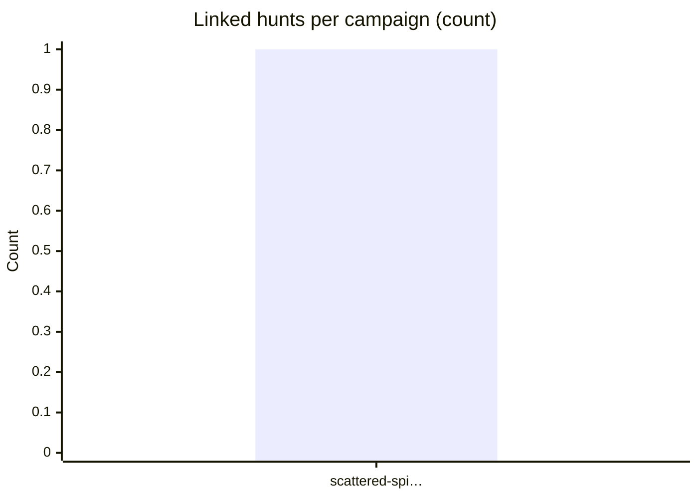
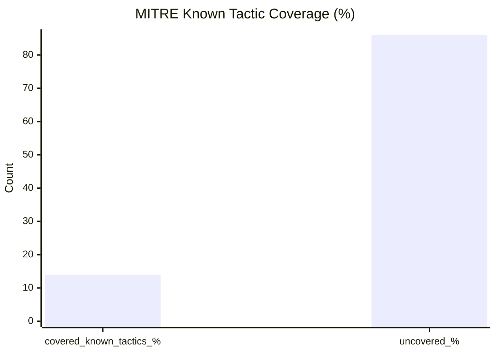

# Threat Hunt Dashboard

_Generated: 2026-05-04 01:52 UTC_

## Active Campaigns

Campaigns with linked hunts (from `campaigns/*.md` and hunt `campaign_slugs` / kebab `campaigns` entries).

| Campaign | Threat actor | # Linked hunts | MITRE % covered (children) | Detections created (hunts) | Last activity | Campaign file |
| --- | --- | ---: | ---: | ---: | --- | --- |
| Scattered Spider MFA Fatigue & Helpdesk Social Engineering Campaign Q2 2026 | Scattered Spider (UNC3944) (cybercrime) | 1 | 14.29 | 1 | 2026-04-27 | [Open](campaigns/scattered-spider-mfa-fatigue-2026.md) |

## Summary Stats

| Metric | Value |
| --- | ---: |
| Hunts scanned | 1 |
| Hunts valid | 1 |
| Hunts invalid | 0 |
| Campaigns valid | 1 |
| Campaigns invalid | 0 |
| Hunts total (metrics scope) | 1 |
| Query blocks extracted | 2 |
| IOC blocks extracted | 2 |
| Hunts with detections | 1 (100.0%) |
| Hunts with preventions | 0 (0.0%) |
| Hunts with visibility created | 0 (0.0%) |

## Visuals

### Hunt Types

### MITRE Coverage

### Threat Actor Types

## Recent Hunts

| Hunt ID | Title | Type | Status | Last Updated |
| --- | --- | --- | --- | --- |
| HUNT-YYYY-XXXX | MFA push fatigue and helpdesk-assisted bypass (OKTA / Entra) under Scattered Spider umbrella | Hypothesis-driven | draft | 2026-04-27 |

## MITRE Coverage Heat Map

| MITRE Tactic ID | Hunts Tagged | Coverage Band |
| --- | ---: | --- |
| `TA0001` | 1 | 🟨 Low |
| `TA0006` | 1 | 🟨 Low |

**Known ATT&CK tactic coverage:** 14.29%

**Top techniques:** T1199 (1), T1556.004 (1), T1566.002 (1), T1621 (1)

## Leadership Export Note

> This dashboard summarizes current threat hunting program output and coverage posture from version-controlled hunt artifacts.

- **Program scale:** 1 hunts in current validated metrics scope.
- **ATT&CK alignment:** 14.29% known tactic coverage represented by hunts.
- **Attribution context:** 100.0% of hunts include named/type threat actor attribution.
- **Campaign intelligence linkage:** 100.0% of hunts mapped to campaign context.
- **Operational outcomes:** detections=1, preventions=0, visibility_created=0.
